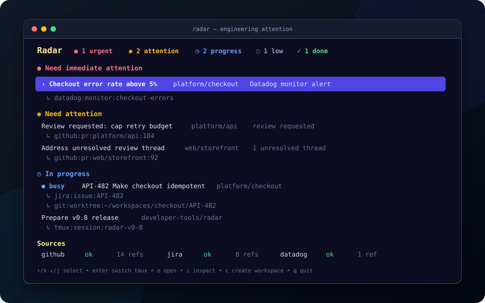

# Radar

**Know what needs your attention—and jump straight into the right workspace.**



<p align="center"><sub>One prioritized view of alerts, reviews, issues, tasks, worktrees, sessions, and sandboxes.</sub></p>

<p align="center"><a href="#integrations">Integrations</a> · <a href="#install">Install</a> · <a href="#quick-start">Quick start</a> · <a href="#workspaces">Workspaces</a> · <a href="#config">Configuration</a></p>

Radar is a local, terminal-first command center for engineering work. It continuously gathers signals from the tools you already use, links related activity into a single task, and explains **why** each item needs attention. Select a task to open its source or switch directly into its tmux workspace.

Instead of checking GitHub, Jira, Datadog, Obsidian, terminals, and worktrees one by one, Radar gives you one queue organized by urgency and current activity.

## Why Radar

- **Prioritize, don't just aggregate.** Work is grouped into immediate, attention, in-progress, low-priority, and recently completed sections.
- **See the whole task.** A Jira issue, pull request, worktree, tmux session, and sandbox can appear as one linked unit rather than five disconnected entries.
- **Resume work instantly.** Press <kbd>Enter</kbd> to switch to the task's tmux session, or create a ready-to-use worktree and session from Radar.
- **Know what changed.** Each row includes the signal behind its state—an alert, review request, unresolved thread, active workspace, or completed source.
- **Stay local and scriptable.** The TUI and JSON-friendly CLI share one Go binary and a lightweight background daemon.

## How it fits into your day

1. Open Radar directly or in a tmux popup.
2. Scan a queue ranked by urgency, not by source.
3. Inspect or open the linked issue, pull request, monitor, or note.
4. Switch into an existing workspace—or create a new worktree, tmux session, and optional sandbox.
5. Clean up linked local resources together when the work is done.

## Integrations

| Integration | Feature |
| --- | --- |
| [**GitHub**](#github) | Surfaces your pull requests, review requests, comments, and unresolved threads. |
| [**Jira**](#jira) | Collects assigned issues and links ticket references across your work. |
| [**Datadog**](#datadog) | Turns unhealthy monitors into tasks and completes them when they recover. |
| [**Obsidian**](#obsidian-authored-tasks) | Uses local Markdown notes as tasks you can create, prioritize, and complete. |
| [**Git**](#git-worktrees) | Tracks worktrees and creates or cleans up multi-repository workspaces. |
| [**tmux**](#tmux-sessions) | Tracks sessions and lets you jump directly into the right workspace. |
| [**Docker SBX**](#docker-sbx-sandboxes) | Tracks, opens, and cleans up sandboxes attached to workspaces. |

## Install

Download the matching archive from the [latest release](https://github.com/ChristianMoesl/radar/releases/latest), verify it with `checksums.txt`, and run its installer:

```sh
archive=radar_<version>_<os>_<arch>.tar.gz
grep -F "  $archive" checksums.txt | shasum -a 256 -c -
tar -xzf "$archive"
"${archive%.tar.gz}/install.sh"
radar version
```

The installer uses `~/.local` by default. Set `PREFIX` to install elsewhere. macOS archives also install the `RadarNotifier.app` companion under `libexec/radar` and register it with Launch Services.

## Update

Download the new release archive, verify it with `checksums.txt`, and run its installer over the existing installation. Run `radar restart` after updating if the daemon is already running.

## Prerequisites

Radar uses these local tools:

- `fd` for fast repository discovery in `radar create`
- `git` for repository and worktree operations
- `tmux` for workspace creation; the default tmux configuration also runs `pi` and `nvim`
- `sbx` and the [`pi-sbx`](https://github.com/ChristianMoesl/pi-sbx) Pi extension on macOS for repositories that enable sandboxed tool execution

On macOS, the daemon uses the installed Radar notifier companion to send host notifications when a task newly needs immediate attention or attention. Clicking a pull-request notification opens the relevant GitHub pull request; clicking a Datadog alert opens its monitor; other task notifications open their task URL when one is available. Existing actionable tasks are not notified again on every refresh or daemon restart. Muted and deprioritized tasks do not produce notifications. If the companion app is not installed, Radar continues without host notifications.

Radar opens task URLs with the platform URL opener when you press `o` and choose a URL-backed source such as Jira, GitHub, or Datadog:

- Linux: requires `xdg-open`, usually provided by `xdg-utils`
- macOS: uses the built-in `open` command

## Quick start

Open Radar. The background daemon starts automatically, refreshes local sources every 15 seconds and remote sources every two minutes, and keeps the task view up to date:

```sh
radar
```

The first launch creates the JSON config reported by `radar config-path`. Press <kbd>f</kbd> to edit it, set `linking_mark_prefixes` for your ticket keys, and configure only the sources you use; unavailable sources are reported in the dashboard without hiding healthy ones.

For a fast, always-available dashboard, open it in a tmux popup:

```sh
tmux display-popup -E "radar"
```

Recommended tmux bindings:

```tmux
bind-key R display-popup -E "radar"
bind-key F display-popup -E "radar fork"
```

| Key | Action |
| --- | --- |
| <kbd>j</kbd> / <kbd>↓</kbd>, <kbd>k</kbd> / <kbd>↑</kbd> | Move between tasks |
| <kbd>Enter</kbd> | Switch to or create the selected task's tmux session |
| <kbd>o</kbd> | Open the source action or link |
| <kbd>i</kbd> | Inspect the selected task and its linked sources |
| <kbd>n</kbd> | Create an Obsidian-backed task |
| <kbd>d</kbd> / <kbd>p</kbd> | Complete or reopen a task / toggle urgent priority |
| <kbd>c</kbd> | Create a workspace |
| <kbd>x</kbd> / <kbd>X</kbd> | Clean up the selected task / garbage-collect eligible workspaces |
| <kbd>f</kbd> | Edit the configuration |
| <kbd>r</kbd> | Refresh sources |
| <kbd>q</kbd> / <kbd>Esc</kbd> | Quit |

The workspace creator walks through repository search, branch selection, and workspace naming. Repository paths are shortened to `~/...` when they are inside your home directory.

## Workspaces

Open the interactive workspace creation flow:

```sh
radar create
```

Create a workspace non-interactively:

```sh
radar create --repo /path/to/repo --base origin/main --name my-feature
```

For a new branch, Radar creates:

- a Git worktree at `<workspace_root>/<repo>/<name>`
- a sanitized branch named after the workspace
- files copied from the source repo when configured
- setup commands run in the new worktree when configured
- a matching tmux session
- user-configured tmux windows and panes; by default, separate `pi` and `nvim` windows

A Radar workspace is one logical bundle: one primary Git worktree, optional member worktrees from other repositories, one tmux session, and at most one SBX sandbox. Radar stores this durable membership in `<workspace_root>/.radar-workspaces.json`; `radar reset` does not remove it.

Every Pi process started by Radar receives the embedded `radar_reconcile_workspace` tool. The agent first calls `radar_workspace_context`, copies its revision and complete `desired` description, changes only the requested resources, and submits the result. Radar validates the difference and fails closed unless the user confirms one consolidated plan through Pi's UI.

The desired description contains the complete worktree set and either optional sandbox additional-mount and port sets or `sandbox: null`. Omitted member worktrees, requested mounts, and ports are removals. Radar-managed mounts for worktrees, Git metadata, and configured `sbx.additional_mounts` remain derived and cannot be removed through this API. The primary worktree and sandbox attachment cannot be removed through reconciliation, and dirty member worktrees fail closed. Ports are TCP4 and bind only on host IPv4 loopback through SBX; existing dual-stack bindings are replaced during reconciliation. Mounts default to read-only when `read_only` is omitted. Sandbox resources are only accepted when the workspace already has a sandbox. Worktree reconciliation remains fully available when SBX is disabled or unavailable for that workspace.

Two read-oriented host tools support discovery from an SBX-isolated Pi session. `radar_workspace_context` reports the revision, capabilities, desired state, current resources, and repositories discovered through `repository_dirs`; `radar_repository_refs` refreshes one selected repository and reports canonical local/origin branches, valid base refs, and existing checkout paths.

The same operations are scriptable. Apply needs no extra prompt because invoking the CLI is already explicit:

```sh
radar workspace-context --workspace /path/to/current/worktree
radar repository-refs --repo /path/to/other-repo
radar reconcile-workspace --workspace /path/to/current/worktree --request "$request" --preview
radar reconcile-workspace --workspace /path/to/current/worktree --request "$request"
```

The request JSON has the shape `{"revision":"<context revision>","desired":<context desired state>}`. Add a worktree by appending either `{"repository":"/repo","branch_mode":"new","name":"feature","base":"origin/main"}` or `{"repository":"/repo","branch_mode":"existing","branch":"feature"}` to `desired.worktrees`. For a sandboxed workspace, replace `desired.sandbox.additional_mounts` with entries such as `{"path":"/absolute/host/path","read_only":true}` and `desired.sandbox.ports` with entries such as `{"host_port":3000,"sandbox_port":3000}`. Keep `desired.sandbox` as `null` for a workspace without SBX.

`--workspace` defaults to the process working directory. Preview and apply return JSON. Repeating the same desired state is safe: Radar observes current worktrees, sandbox mounts, and published ports and converges after retryable partial failures.

For an existing branch, Radar reuses its local branch or creates a same-named local branch that tracks `origin/<branch>`. Standalone workspace creation defaults the workspace name to the branch. Creation from a selected task keeps the task-derived workspace name, so sequential tasks can each use a shared branch such as `main` after the previous workspace is cleaned up. A branch already checked out in a Radar workspace reopens that workspace; Radar rejects attaching it to a different task until the existing workspace is cleaned up. To keep a normal source checkout for `.env` files, local services, and database setup while making `main` available to a Radar worktree, park the clean source checkout on the remote-tracking commit:

```sh
git fetch
git switch --no-overwrite-ignore --detach origin/main
```

Ignored development files remain in place. Radar refuses to move a branch that is still checked out in the source repository.

Configure repo-specific workspace setup with a repo-local `.radar.json` file:

```json
{
  "copy_files": [".env", ".env.local"],
  "setup": ["pnpm install --frozen-lockfile"],
  "sbx": {
    "enabled": true,
    "kit": {"name": "radar", "path": "~/kits/radar"},
    "additional_mounts": ["~/repo-tools"]
  },
  "model": "anthropic/claude-sonnet-4",
  "thinking": "high"
}
```

`copy_files` paths are relative to the repository root. `setup` commands run in order from the new worktree in a temporary setup window after tmux and any sandbox are available. Without sandboxing they run on the host. On macOS, when `sbx.enabled` is true, Radar first creates an SBX sandbox for the workspace with `sbx create --name <sandbox-name> [--kit <path>] <kit-name>`, then runs setup commands inside it with `sbx exec`. The deterministic sandbox name is capped at 63 characters. The sandbox mounts every member worktree, each external writable Git common directory, and global and repository `sbx.additional_mounts`. Pi and nvim run on the host; the globally installed [`pi-sbx`](https://github.com/ChristianMoesl/pi-sbx) extension discovers the matching sandbox and routes Pi's regular tools through `sbx exec`. Radar separately injects its own host-side Pi extension for workspace reconciliation; users do not install a Radar Pi package. Install `pi-sbx` with `pi install git:github.com/ChristianMoesl/pi-sbx`. `model` and `thinking` are passed to Pi as `--model` and `--thinking` for the workspace session.

Changing the worktree membership or requested additional mounts of a sandboxed workspace reconciles the complete mount set by removing and recreating the sandbox under the same name. This interrupts processes inside the sandbox, so the Pi tool warns before confirmation. Radar waits for removal to converge and retries transient SBX container-start failures up to three times with bounded backoff and cleanup between attempts. Plans show the effective mount count and warn at 20 or more mounts without enforcing a limit. Radar then reconciles the complete desired loopback port set with `sbx ports`. If reconciliation fails, Radar keeps completed work and desired registry state and returns `ok: false` with `retryable: true`; the Pi tool reports completed work and asks the agent to re-inspect before retrying. Reconciliation phases and counts are recorded at `radar log-path` without logging complete mount commands.

Enable sandboxes by default, select the kit, and mount additional host directories into every sandbox in the user config at `radar config-path`:

```json
{
  "sbx": {
    "enabled": true,
    "kit": {"name": "shell"},
    "additional_mounts": ["~/shared-tools", "/opt/company-config"]
  }
}
```

A repository's `.radar.json` can use the same `sbx` fields. Repository `enabled` and `kit` values override the user settings; repository additional mounts are appended to the global list. `kit.name` defaults to `shell`; when optional `kit.path` is set, Radar expands a leading `~/` and passes it as `--kit <path>`. Additional-mount paths must be absolute or start with `~/`; Radar expands `~` and creates missing directories before starting SBX. Empty entries and duplicate paths are ignored, and the workspace remains the primary mount.

Configure workspace windows, panes, layouts, and commands in the user config:

```json
{
  "tmux": {
    "windows": [
      {
        "name": "workspace",
        "layout": "horizontal",
        "panes": [
          {"command": "pi $RADAR_PI_ARGS"},
          {"command": "nvim ."}
        ]
      }
    ]
  }
}
```

Every window requires a unique `name` and at least one pane command. Commands run from the workspace directory. The configuration must contain `$RADAR_PI_ARGS` exactly once; Radar replaces it with shell-quoted model, thinking, session, and optional fork arguments before starting tmux. A task-created workspace derives Pi's session identity from the stable task linking key while keeping the readable workspace name as Pi's display name. Renaming the task therefore does not move its Pi history to another task, and different tasks using the same branch do not share a Pi session. Supported layouts are `horizontal`, `vertical`, `main-horizontal`, `main-vertical`, and `tiled`. Omitting `layout` leaves tmux's initial pane layout unchanged. The pane containing `$RADAR_PI_ARGS` is focused after creation.

When run inside tmux, Radar switches to the new session.

Fork the current tmux workspace into a sibling workspace and fork its Pi session:

```sh
radar fork
```

`radar fork` detects the current git worktree and tmux session, asks for the base branch with the current branch prefilled, asks for the new workspace name, starts Pi with `--fork`, and switches to the new tmux session.

Clean up every local resource linked to a task:

```sh
radar cleanup <task-id>
```

Cleanup shows one confirmation covering all linked Git worktrees, tmux sessions, and SBX sandboxes. For a multi-worktree logical workspace, it includes every member but removes the shared session and sandbox once. Dirty worktrees are called out explicitly and their uncommitted changes are discarded only after confirmation. Git branches, Jira issues, and GitHub pull requests are preserved. Standalone local-resource tasks are handled by the same command; for example, cleaning up a standalone tmux task removes only that session.

The daemon automatically garbage-collects local workspaces for tasks that have been done for at least 24 hours. A registered multi-worktree workspace is one conservative cleanup bundle: Radar skips all of it if any member is dirty or its shared tmux session is attached. Run `radar gc`, or press `X` in the TUI, to clean eligible done-task workspaces immediately without waiting for the 24-hour retention period. Manual garbage collection keeps the same clean-worktree and detached-session safety checks. Radar sends the garbage-collection result as a host OS notification.

## Obsidian-authored tasks

Configure one Obsidian vault before creating tasks:

```json
{
  "obsidian": {
    "vault_path": "~/Documents/Obsidian/Work"
  }
}
```

The vault and its `.obsidian/` directory must already exist. Radar creates `Tasks/` inside it. Each task is one direct Markdown child named after its title, such as `Tasks/Write the release process in Notion.md`, with a source-owned UUID in its frontmatter:

```sh
radar task create --title "Write the release process in Notion"
radar task done <task-id>
radar task reopen <task-id>
radar task priority <task-id> urgent
radar task priority <task-id> normal
```

The note filename owns the title, while its frontmatter owns open/done state, normal/urgent priority, and timestamps. The body owns working notes and outcomes. Radar projects those facts with live Jira, GitHub, Git, tmux, and SBX activity. An open normal note is low priority, urgent is immediate, linked activity can promote open work, and a done note remains terminal. Press `n`, `d`, and `p` for the same operations in the TUI, or `o` to open the note in Obsidian.

Obsidian notes are task records rather than workspaces. Activating an Obsidian-only task can create a Git workspace using the note title as its default name; Radar stores the task association in its local workspace registry so the resulting worktree rejoins the same task. Radar preserves unknown frontmatter and the complete note body during atomic mutations and never deletes task notes. See [the Obsidian integration contract](docs/integrations/obsidian.md) for the schema and failure behavior.

## Scriptable commands

```sh
radar task create --title <title>
radar task done <task-id>
radar task reopen <task-id>
radar task priority <task-id> urgent|normal
radar status
radar tasks
radar reconcile-workspace --request <json> [--workspace <path>] [--preview]
radar workspace-context [--workspace <path>]
radar repository-refs --repo <repo>
radar cleanup <task-id>
radar gc
radar refresh
radar reset
radar stop
radar restart
radar config-path
radar state-path
radar log-path
```

Task commands return JSON.

## GitHub

GitHub integration uses the GitHub CLI. Its main GraphQL request includes the current viewer and runs concurrently with configured tracked-PR searches. Make sure authentication works first:

```sh
gh auth status
```

Radar currently tracks:

- PR review requests assigned directly to you as `needs attention`
- open PRs authored by you as `in progress`

Radar checks GitHub rate limits before collection. When a budget is low, Radar pauses GitHub collection until GitHub's reset time. TUI and CLI status reads use cached daemon state and do not trigger GitHub requests.

## Jira

Radar collects authoritative assigned Jira Cloud work and discovers configured linking marks such as `ABC-123` in existing task titles. Title discovery fetches issues directly even when they are unassigned or outside the configured authoritative issue types.

Configure credentials through the environment:

```sh
RADAR_JIRA_BASE_URL="https://your-site.atlassian.net"
RADAR_JIRA_EMAIL="you@example.com"
RADAR_JIRA_API_TOKEN="..."
RADAR_JIRA_CLOUD_ID="..."
# alternatively: RADAR_JIRA_API_BASE_URL="https://api.atlassian.com/ex/jira/<cloud-id>/rest/api/3"
```

`jira.authoritative_issue_types` controls which automatically collected or title-discovered Jira issues can control a Radar task. It defaults to `Task`, `Bug`, and `Sub-task`:

```json
{
  "jira": {
    "authoritative_issue_types": ["Task", "Bug", "Sub-task"],
    "status_mapping": {
      "In Progress": "in_progress",
      "In Review": "in_progress",
      "Blocked": "attention"
    },
    "unmapped_status": "low_priority"
  }
}
```

Names are trimmed and matched case-insensitively. An explicitly empty array skips assigned Jira search and makes every automatically title-discovered issue informational. Omitting the option uses the three default types. The former `jira.issue_types` option is not supported.

Authoritative Jira refs can provide the task title, identity, attention, linking, and contributing lifecycle. An out-of-scope title discovery is shown as an informational **Jira reference** with its URL, status, issue type, priority, and status category, but it cannot rename, merge, reprioritize, complete, or reopen the task. Removing a key from all current title-bearing facts removes its derived reference on a complete refresh. When a Jira ref joins an Obsidian-authored task, Obsidian remains the primary lifecycle owner.

Every distinct key in a title is collected in deterministic title order, with up to 50 keys fetched through one batched Jira search per refresh. Radar runs that batch concurrently with the assigned-issue search and deduplicates their results. Informational refs remain independent; all authoritative refs participate in linking and lifecycle, the first authoritative key supplies the Jira title, and completion requires every authoritative remote ref to be done. A failed batch or requested keys missing from its result are non-fatal, retain previously known refs, and are reported in Jira source status.

Jira status names are trimmed and matched case-insensitively. Mapping targets may be `low_priority`, `in_progress`, `attention`, or `immediate`; Jira's Done category remains authoritative only for authoritative refs. By default, `In Progress` and `In Review` are in progress and every other authoritative non-done status is low priority. An explicitly empty `status_mapping` sends every authoritative non-done issue to `unmapped_status`.

## Datadog

Radar collects a current snapshot of configured unhealthy Datadog monitors every two minutes. It makes one monitor-search request per full refresh and does not query logs, traces, metrics, events, or monitor history. Each matching monitor becomes one Radar task:

- `Alert` becomes `immediate`.
- `Warn` and `No Data` become `attention` when included in `monitor_statuses`.
- A previously tracked monitor that no longer matches becomes `done` with reason `Datadog monitor recovered`.

Configure the scope as a Datadog monitor search query in the user config. Radar requires a non-empty query so it cannot accidentally collect every unhealthy monitor in an organization. `monitor_statuses` selects which states Radar appends to the query and ingests. It must contain one or more of `Alert`, `Warn`, and `No Data`; matching is case-insensitive. The default includes all three. Do not include alert status in `monitor_query`.

For example, this configuration ignores `No Data` monitors:

```json
{
  "datadog": {
    "monitor_query": "tag:team:cap",
    "monitor_statuses": ["Alert", "Warn"]
  }
}
```

Provide credentials only through environment variables:

```sh
RADAR_DATADOG_API_KEY="..."
RADAR_DATADOG_APP_KEY="..."
RADAR_DATADOG_SITE="datadoghq.eu"
```

`RADAR_DATADOG_API_KEY` and `RADAR_DATADOG_APP_KEY` are required, and the application key must have permission to read monitors. `RADAR_DATADOG_SITE` is optional and defaults to `datadoghq.eu`; set it to the Datadog site hostname for another region, such as `us3.datadoghq.com`. Radar does not read Datadog credentials from its JSON config or a credentials file.

The query is limited to 1,000 results in one request. If it matches more, collection is marked as an error and the previous Datadog tasks are retained; narrow `datadog.monitor_query`. Because Radar polls current state rather than alert events, an alert that both starts and recovers between full refreshes is intentionally not shown.

A newly collected monitor produces the normal Radar macOS notification. Clicking it opens the monitor directly in Datadog. Radar does not repeat the notification on every refresh while the monitor remains unhealthy.

## Git worktrees

Radar collects Git checkouts at `<workspace_root>/<repo>/<workspace>`. Registered members emit a shared `workspace-group:<id>` linking key, so worktrees from different repositories appear in one task even without a configured linking mark. Radar also attaches worktrees by configured linking marks such as `ABC-123`. Regular repositories outside the configured workspace root are ignored. Branch names do not affect collection, so a workspace checked out directly on `main` remains visible.

## tmux sessions

Radar collects tmux sessions from the local tmux server and attaches them to matching tasks when their name contains a configured linking mark, or when the session working directory matches a Git worktree path. Sessions without matches are shown as standalone in-progress tasks.

Radar-created Pi sessions publish a generic busy signal through the embedded Radar extension while the agent is actively working. Radar projects activity from source refs onto the task, and the TUI shows `● busy` on the task row until Pi settles. Busy is independent of task attention and does not affect categorization, sorting, or notifications.

Tmux session refs use `#{session_id}` for stable identity, so renaming a tmux session does not create a new Radar task. Selecting a tmux-backed task switches to the stable session target.

## Docker sbx sandboxes

Radar collects Docker sbx sandboxes with `sbx ls --json` when `sbx` is installed. Sandboxes attach to matching tasks through configured linking marks in the sandbox/workspace name and through their primary workspace path. Sandboxes without matches are shown as standalone in-progress tasks.

The default sandbox kit name is `shell`. Set `sbx.kit.name` to select another kit and optionally set `sbx.kit.path` to pass its location with `--kit`. Configure `sbx.additional_mounts` to add host directories to every sandbox Radar creates.

## Config

Radar uses one editable JSON config file:

```sh
radar config-path
```

By default this is `$XDG_CONFIG_HOME/radar/config.json` or `~/.config/radar/config.json`.
The daemon creates an example file on startup if it does not exist yet.

Example:

```json
{
  "repository_dirs": ["~/workspace", "~/code", "~/src", "~/dev", "~/projects"],
  "linking_mark_prefixes": ["ABC"],
  "obsidian": {"vault_path": "~/Documents/Obsidian/Work"},
  "model": "github-copilot/claude-sonnet-4.5",
  "thinking": "medium",
  "sbx": {
    "enabled": true,
    "kit": {"name": "shell"},
    "additional_mounts": []
  },
  "datadog": {
    "monitor_query": "tag:team:cap",
    "monitor_statuses": ["Alert", "Warn", "No Data"]
  },
  "jira": {
    "authoritative_issue_types": ["Task", "Bug", "Sub-task"],
    "status_mapping": {
      "In Progress": "in_progress",
      "In Review": "in_progress"
    },
    "unmapped_status": "low_priority"
  },
  "github": {
    "filters": {
      "mute_repos": ["some-org/noisy-repo"],
      "deprioritize_repos": ["some-org/archive-*"],
      "mute_users": ["dependabot[bot]"],
      "deprioritize_users": ["renovate[bot]"],
      "rules": [
        {
          "name": "Track bot PRs in owned repos",
          "repos": ["some-org/platform-*"],
          "users": ["renovate[bot]", "dependabot[bot]"],
          "action": "deprioritize"
        }
      ]
    }
  }
}
```

`linking_mark_prefixes` is mandatory and lists the identifier prefixes Radar may use to link work across sources, for example `["ABC"]` permits `ABC-722`. Prefixes are normalized to uppercase, must start with a letter, and may contain only letters and numbers. Radar matches only complete `<PREFIX>-<NUMBER>` marks, so unrelated suffixes such as `Origin-096e274f` are ignored.

`obsidian.vault_path` is required for task authoring and must identify an existing vault containing `.obsidian/`; Radar creates its fixed `Tasks/` root. `repository_dirs` controls where `radar create` discovers base repositories. `workspace_root` controls where Radar creates worktrees. When omitted, the workspace root is `$XDG_DATA_HOME/radar/workspaces`, falling back to `~/.local/share/radar/workspaces`. `model` and `thinking` are passed to Pi as `--model` and `--thinking` for new workspace sessions unless the repository's `.radar.json` defines its own values. `jira.authoritative_issue_types` defaults to Task, Bug, and Sub-task; an explicit empty array disables assigned Jira collection and makes automatic title discoveries informational. `datadog.monitor_query` is the user-owned scope for Datadog monitor collection, while `datadog.monitor_statuses` selects the unhealthy states to ingest and defaults to Alert, Warn, and No Data. Secrets are accepted only from `RADAR_DATADOG_API_KEY` and `RADAR_DATADOG_APP_KEY`.

Muted tasks are hidden from the TUI and counts. Deprioritized tasks move to the low-priority section. User filters also apply to GitHub comment and review actors: muted or deprioritized actor activity does not promote a PR to attention. Confirmed GitHub bots match both their API login and the equivalent `[bot]` alias, so `gemini-code-assist[bot]` matches the GraphQL login `gemini-code-assist`. Repository and user patterns support `*` wildcards, and rule matches are case-insensitive.

## Local state

The daemon stores rebuildable task records and source-ref observations locally. Task records provide cache-local numeric IDs, lifecycle projection, source-ref ownership, and acknowledgements. Obsidian notes—not this cache—own authored task content and lifecycle.

Radar groups work by linking mark, source-owned identity, and workspace keys. A primary lifecycle ref controls completion when present; otherwise contributing work-item refs retain their combined lifecycle behavior.

Use `radar reset` to discard collected observations and rebuild them from integrations. Acknowledgements may be retained. An incompatible state version is intentionally discarded and recollected; malformed state still fails closed.

```sh
radar state-path
```

By default this is `$XDG_STATE_HOME/radar/tasks.json` or `~/.local/state/radar/tasks.json`.

Override it with `RADAR_STATE=/path/to/tasks.json`.

Radar writes state atomically through a single serialized writer. A malformed state file prevents startup. An incompatible `stateVersion` is treated as a disposable cache and rebuilt from source integrations.

## Logs

The daemon writes logs to:

```sh
radar log-path
```

By default this is `$XDG_STATE_HOME/radar/radar.log` or `~/.local/state/radar/radar.log`.

Follow logs with:

```sh
tail -f "$(radar log-path)"
```

Override the log path with `RADAR_LOG=/path/to/radar.log`.

Set log level with:

```sh
RADAR_LOG_LEVEL=debug radar daemon
```

Supported levels: `debug`, `info`, `warn`, `error`. Default is `info`.

## Documentation

- [Architecture](ARCHITECTURE.md)
- [Attention and prioritization](docs/attention-algorithm.md)
- [Integration internals](docs/integrations.md)
- [Contributing, building, and releasing](CONTRIBUTING.md)
