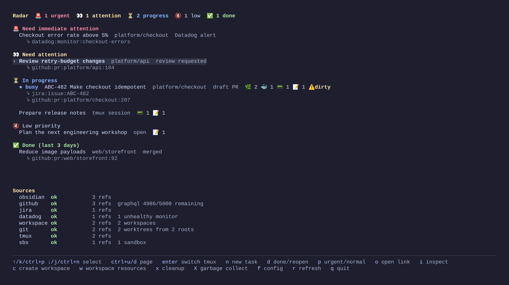

# Radar

**Know what needs your attention—and jump straight into the right workspace.**



<p align="center"><sub>Rendered from Radar's TUI with example data, using Catppuccin Mocha colors.</sub></p>

<p align="center"><a href="#integrations">Integrations</a> · <a href="#install">Install</a> · <a href="#quick-start">Quick start</a> · <a href="#workspaces">Workspaces</a> · <a href="#config">Configuration</a></p>

Radar is a local, terminal-first command center for engineering work. It continuously gathers signals from the tools you already use, links related activity into a single task, and explains **why** each item needs attention. Select a task to open its source or switch directly into its tmux workspace.

Instead of checking GitHub, Jira, Datadog, Obsidian, terminals, and worktrees one by one, Radar gives you one queue organized by urgency and current activity.

## Why Radar

- **Prioritize, don't just aggregate.** Work is grouped into immediate, attention, in-progress, low-priority, muted, and recently completed sections.
- **See the whole task.** A Jira issue, pull request, worktree, tmux session, and sandbox can appear as one linked unit rather than five disconnected entries.
- **Resume work instantly.** Press <kbd>Enter</kbd> to switch to the task's tmux session, or create a ready-to-use worktree and session from Radar.
- **Know what changed.** Each row includes the signal behind its state—an alert, review request, unresolved thread, active workspace, or completed source.
- **Stay local and scriptable.** The TUI and JSON-friendly CLI share one Go binary and a lightweight background daemon.

## How it fits into your day

1. Open Radar directly or in a tmux popup.
2. Scan a queue ranked by urgency, not by source.
3. Inspect or open the linked issue, pull request, monitor, or note.
4. Switch into an existing workspace—or create a new worktree, tmux session, and optional sandbox.
5. Clean up linked local resources together when the work is done.

## Integrations

| Integration | Feature |
| --- | --- |
| [**GitHub**](#github) | Surfaces your pull requests, review requests, comments, and unresolved threads. |
| [**Jira**](#jira) | Collects assigned issues and links ticket references across your work. |
| [**Datadog**](#datadog) | Turns unhealthy monitors into tasks and completes them when they recover. |
| [**Obsidian**](#obsidian-authored-tasks) | Uses local Markdown notes as tasks you can create, prioritize, and complete. |
| [**Git**](#git-worktrees) | Tracks worktrees and creates or cleans up multi-repository workspaces. |
| [**tmux**](#tmux-sessions) | Tracks sessions and lets you jump directly into the right workspace. |
| [**Docker SBX**](#docker-sbx-sandboxes) | Tracks, opens, and cleans up sandboxes attached to workspaces. |

## Install

Download the matching archive from the [latest release](https://github.com/ChristianMoesl/radar/releases/latest), verify it with `checksums.txt`, and run its installer:

```sh
archive=radar_<version>_<os>_<arch>.tar.gz
grep -F "  $archive" checksums.txt | shasum -a 256 -c -
tar -xzf "$archive"
"${archive%.tar.gz}/install.sh"
radar version
```

The installer uses `~/.local` by default. Set `PREFIX` to install elsewhere. It installs the MIT license notice under `share/radar/LICENSE` in that prefix. It also creates `$XDG_CONFIG_HOME/radar/AGENTS.md`, falling back to `~/.config/radar/AGENTS.md`, with default instructions for Radar-managed agent sessions. An existing instruction file is never changed. macOS archives also install the `RadarNotifier.app` companion under `libexec/radar` and register it with Launch Services.

### Pi integration

First-run setup offers to install `pi-radar` in Pi's user configuration (Pi 0.85.1 or newer, Node.js 24+). For sandboxed workspaces, also install `pi-sbx`. To install the packages yourself:

```sh
pi install npm:@christianmoesl/pi-radar
pi install npm:@christianmoesl/pi-sbx
```

`pi-radar` provides Radar workspace tools and context; `pi-sbx` provides sandbox tool routing. **`pi-sbx` >=0.6.0 is required for early sandboxed launch.** Installing the SBX CLI alone does not install either Pi package.

Radar-launched interactive Pi sessions show one combined, non-blocking recommendation per Pi profile for missing packages. It explains each package's benefits and installation command; `/radar-dismiss-install-hint` hides it. The notice never installs packages or changes Pi settings. Only the foreground onboarding wizard installs dependencies, after explicit permission. The notice checks the running Pi's Radar tools and personal/project declarations (including `PI_CODING_AGENT_DIR`), suppresses advice independently for each known configured or explicitly disabled package, and does not appear in RPC/print mode. Having `pi-radar` installed does not hide missing `pi-sbx` advice. This helper gives installation advice, not version enforcement. Pi runs on the host even for sandboxed workspaces, so install both packages in that host Pi profile. For a custom agent directory, prefix each command with `PI_CODING_AGENT_DIR=/path/to/profile`; the suggested commands include the matching directory. Restart Pi after installation.

All launches load a small **notice-only helper**, not the integration; early sandboxed launches additionally load the required pi-sbx prerequisite guard described below. Radar caches these helpers under `$XDG_CACHE_HOME/radar/pi/` (or the platform's user cache directory) and records that the notice was shown in `<Pi agent directory>/radar/install-hint-seen`. Removing that marker allows the recommendation to appear again. Existing settings and workspaces are not rewritten; unreadable settings or unavailable notice storage simply skip the advice.

The `pi-radar` npm package contains only the Pi extension; it does not install the Radar CLI, and extension users do not need pnpm. If switching from a Git installation, first remove its source with `pi remove git:github.com/ChristianMoesl/radar` (use the exact source from `pi list` if it is pinned to a tag). Then install the npm package and restart Pi. Git and npm sources have different package identities, so keeping both can load the extension twice.

Keep the `radar` binary on PATH. The installed package checks Radar's registry at Pi startup and activates only inside a registered workspace anchor or one of its members. Outside those workspaces it adds no Radar tools, commands, instructions, skills, or activity reporting. A missing or failing Radar binary leaves the extension inactive; run `radar workspace-context --registration-only` to diagnose discovery, then restart Pi or use `/reload`.

You can start Pi yourself in a new tmux window; Radar does not need to launch it:

```sh
cd /path/to/radar/workspace
pi       # Start a new conversation with Radar integration
pi -c    # Continue the latest conversation for this directory
```

Use the workspace anchor to share its conversation history; member directories have their own Pi session history. Manual launches use normal Pi model and session defaults. Radar's own launcher still supplies its explicit model, thinking, name, session ID, fork and initial-prompt arguments when applicable.

Sandbox routing remains entirely owned by the separately installed `pi-sbx` extension. `pi-radar` neither selects sandboxes nor overrides Pi's shell or filesystem tools.

**Upgrading from the injected extension:** update the Radar binary and install this package together, then restart existing Pi processes. Radar no longer materializes or passes `--extension` for its integration. Remove any manually configured reference to the old `$XDG_DATA_HOME/radar/pi/radar.ts` (normally `~/.local/share/radar/pi/radar.ts`) so only the installed package loads. The old file is unused and can be removed after old sessions have stopped. No workspace registry or conversation migration is needed.

## Update

Download the new release archive, verify it with `checksums.txt`, and run its installer over the existing installation. **If upgrading from the former per-task ignore feature, stop the daemon and run the [explicit task-muting migration](docs/integrations/obsidian.md#migrating-task-muting) before starting the new daemon.** For other updates, run `radar restart` if the daemon is already running. Update unpinned Pi packages in the same host Pi profile:

```sh
pi update npm:@christianmoesl/pi-radar
pi update npm:@christianmoesl/pi-sbx
```

Restart Pi afterwards. `pi update` without a package source updates Pi itself, not these packages. To pin either extension, use `pi install npm:@christianmoesl/pi-radar@<version>` or `pi install npm:@christianmoesl/pi-sbx@<version>`; choose `pi-sbx` >=0.6.0 for early sandboxed launch. Versioned npm sources are pinned and skipped by package updates, so move to a new pinned release by installing its version explicitly. The Radar CLI and `pi-radar` npm package share the same release version (the npm version omits the tag's leading `v`); `pi-sbx` is versioned separately.

**Before installing workspace expiry:** already-completed registered workspaces use their existing task completion time (`DoneAt`), not the update or daemon startup time. Workspaces already eight days past completion can be removed at the next GC run, permanently losing local changes, unpublished commits, and unknown workspace files. Review and preserve needed work or reopen the task before installing. There is no recovery archive or new startup grace period, and no schema/configuration change. See [workspace expiry and rollout](docs/workspace-cleanup.md#workspace-expiry).

## Prerequisites

Radar uses these local tools:

- `fd` for fast repository discovery in `radar create`
- `git` for repository and worktree operations
- `tmux` 3.2+ for workspace sessions and dashboard popups
- Node.js 24+ as Pi's runtime, npm, Pi 0.85.1+, and `pi-radar`
- `gh` for GitHub authentication and pull requests
- `sbx` and the [`pi-sbx`](https://github.com/ChristianMoesl/pi-sbx) Pi extension >=0.6.0 on macOS for repositories that enable sandboxed tool execution

Fresh onboarding creates a Pi-only workspace layout. Neovim is optional; existing editor panes and custom layouts are preserved.

On macOS, the daemon uses the installed Radar notifier companion to send host notifications when a task newly needs immediate attention or attention. Clicking a pull-request notification opens the relevant GitHub pull request; clicking a Datadog alert opens its monitor; other task notifications open their task URL when one is available. Existing actionable tasks are not notified again on every refresh or daemon restart. Tasks hidden by repository/user mute filters, tasks with the per-task muted preference, and deprioritized tasks do not produce attention notifications. If the companion app is not installed, Radar continues without host notifications.

Radar opens task URLs with the platform URL opener when you press `o` and choose a URL-backed source such as Jira, GitHub, or Datadog:

- Linux: requires `xdg-open`, usually provided by `xdg-utils`
- macOS: uses the built-in `open` command

## Quick start

Run Radar in a terminal. On first startup it guides you through tool installation, directories, and optional integrations. After setup, the background daemon refreshes local sources every 15 seconds and remote sources every two minutes:

```sh
radar
```

First startup runs the same guided flow as `radar setup`:

1. Check Git, tmux, fd, Node.js, npm, Pi, pi-radar, and GitHub CLI; show and confirm any installation command. Declining a required installation stops setup.
2. If tmux was installed, preview a starter configuration. For existing tmux, offer only the prefix + r popup binding, preserving other settings.
3. Ask for your repository checkout directory, workspace root, and task-notes directory. Notes may live in an Obsidian vault, but do not have to.
4. Offer GitHub, Jira, and Datadog. Check GitHub CLI authentication and offer login. For Jira, ask for site/email/token, discover the Cloud ID, verify access, and collect multiple ticket prefixes. For Datadog, ask for site/API endpoint, API key, application key, and a scoped monitor query, then verify monitor access.
5. Show `config.json`, hidden-secret indicators, and any tmux additions. Save only after explicit confirmation.

Settings go in `~/.config/radar/config.json`; integration secrets go in a separate owner-only `secrets.json` beside it (both respect `$XDG_CONFIG_HOME`). `radar setup` can be run again to review and change existing settings. It prefills current values, retains unchanged secrets and custom layouts, and saves only after confirmation. Automatic setup on startup still runs only when config is missing. See [setup, security, and installation requirements](docs/installation.md).

`radar` opens the dashboard directly in your current terminal, inside or outside tmux. Only opening a workspace activates tmux: outside tmux, Radar attaches to the workspace session and returns to the dashboard when you detach; inside tmux, it switches the current client. The optional **prefix + r** binding opens Radar as a popup when you are already using tmux.

The dashboard uses [Catppuccin Mocha](https://catppuccin.com/palette/) colors while keeping your terminal background. Tasks remain a flowing list with inline metadata and resource badges. A blank line separates tasks without separating their source references. The task area fills the available popup height, keeping Sources and shortcuts at the bottom even when the list is short. Sources starts collapsed to a one-line health summary; failures and other non-healthy states remain visible, with disabled integrations counted separately. Press `s` to show or hide the full source diagnostics without changing the selected task. The list uses the reclaimed rows, and refreshes preserve your choice for the current dashboard session. Outer padding shrinks on smaller terminals, and the footer wraps between shortcuts so every action stays visible.

Muted and Done have selectable headers and start collapsed. Move to a header with `j`/`k` or `↓`/`↑`, then press `Enter` to expand or collapse it. Counts remain visible; hidden tasks and their source refs are skipped by navigation. Each section remembers its choice during the current dashboard session, including refreshes. Empty sections are omitted. Active section headers remain non-selectable.

When the selected task becomes muted or done, the overview stays among active tasks: it selects the next task at that position, or the previous task when handling the last active one. If no active tasks remain, selection moves to a visible section header without expanding it. This applies to successful mutations and background updates; delayed responses do not steal focus after you navigate elsewhere. Unmuting unfinished work, reopening, and priority changes follow the selected task, and Inspect stays on the task being inspected. Done remains sorted by completion time, newest first; equal timestamps keep their existing order, and tasks without a valid completion time appear last. Collapsing does not change its three-day display retention or unresolved-workspace exception.

The `o` view lists every source action and link. Move with `j`/`k` or `↓`/`↑` and press `Enter` to open the selection; the list scrolls to keep it visible. Displayed letter/digit shortcuts open entries directly, reserving `j`, `k`, and `q` for navigation and quitting. Entries without an available shortcut leave that column blank and remain selectable. Press `Esc` or `Backspace` to return.

Recommended tmux bindings:

```tmux
bind-key r display-popup -E -w 90% -h 90% -d '#{pane_current_path}' radar
bind-key F display-popup -E "radar fork"
```

| Key | Action |
| --- | --- |
| <kbd>j</kbd> / <kbd>↓</kbd>, <kbd>k</kbd> / <kbd>↑</kbd> | Move between tasks |
| <kbd>Enter</kbd> | Switch to or create the selected task's tmux session |
| <kbd>o</kbd> | Open the source action or link |
| <kbd>i</kbd> | Inspect the selected task and its linked sources |
| <kbd>n</kbd> | Create an Obsidian-backed task |
| <kbd>d</kbd> / <kbd>p</kbd> | Complete or reopen a task / toggle urgent priority |
| <kbd>m</kbd> | Mute or unmute the selected task |
| <kbd>D</kbd> | Delete an authored task with confirmation (move to vault trash) |
| <kbd>c</kbd> | Create a workspace |
| <kbd>w</kbd> | Edit the selected task's workspace resources |
| <kbd>x</kbd> / <kbd>X</kbd> | Clean up the selected task / garbage-collect eligible workspaces |
| <kbd>f</kbd> | Edit the configuration |
| <kbd>s</kbd> | Show or hide source diagnostics |
| <kbd>r</kbd> | Refresh sources |
| <kbd>q</kbd> / <kbd>Esc</kbd> | Quit |

The workspace editor starts with a name and a draft. Add zero or more repositories, then press Enter to create and open the workspace without a confirmation dialog. Radar still validates the complete plan before applying it. Every workspace automatically gets a canonical Obsidian note exposed as `notes.md`. Press `w` to edit an existing workspace, `a` to add a repository, `x` to remove the selected repository. Repository addition uses repository search and branch selection. New branch names are prefilled once from the workspace name using Radar's branch-name sanitization. You can edit or clear the suggestion without changing the workspace name; Radar does not overwrite your edits. Each added repository starts with its own suggestion. It tries to refresh origin before listing branches. If that fetch fails, Radar shows a warning and continues with locally cached refs, so previously fetched branches remain available offline. Repository paths are shortened to `~/...` when they are inside your home directory.

## Workspaces

Open the interactive workspace creation flow:

```sh
radar create
```

Create an empty workspace non-interactively:

```sh
radar create --name investigation
```

Create a Git-first workspace non-interactively:

```sh
radar create --repo /path/to/repo --base origin/main --name my-feature
```

Radar creates one stable anchor with nested worktree members:

```text
<workspace_root>/my-feature/
├── notes.md -> <vault>/Tasks/my-feature--2c965c99/my-feature.md
└── repository--my-feature/
```

Pi, tmux, any configured editor, and optional SBX start in the anchor. Repo-specific copy and setup rules run in the member. Additional members become siblings and no member is primary.

Activating an Obsidian-only task prefills its note in the same workspace editor, without requiring repository selection:

```text
<workspace_root>/plan-authentication/
└── notes.md -> <vault>/Tasks/Plan authentication--2c965c99/Plan authentication.md
```

An automatically created note starts with an empty body. Note creation happens only during apply, after plan validation. A task-notes directory is required and has no enable/disable switch; an unavailable or unconfigured directory prevents creation before resources are provisioned. Obsidian itself is optional. If the task already has an authored note, Radar reuses it. Attached notes cannot be replaced or detached through workspace controls. The same Pi session remains active while the task moves between planning and zero or more Git members.

Radar stores every workspace record in the single `<workspace_root>/.radar-workspaces.json` registry. `radar reset` does not remove it. The current registry schema rejects old primary-worktree records rather than migrating them implicitly.

With `pi-radar` installed, Pi sessions started inside a registered Radar workspace receive three host tools:

- `radar_workspace_context` resolves the current anchor or member and returns its revision, complete desired state, note metadata, member status, sandbox resources, and discovered repositories.
- `radar_repository_refs` refreshes one selected repository when possible and returns canonical branches, base refs, and checkout paths.
- `radar_reconcile_workspace` previews and applies complete worktree, requested-mount, and port state. It applies validated plans automatically by default; set `workspace.auto_confirm` to `false` to require confirmation.

The context tool returns only the current logical workspace, not all registry records. It never returns note contents.

Creation and edits share the resource planner and apply engine. New workspace creation in the TUI applies the validated plan directly. Edits to existing workspaces still show a preview and confirmation, including dirty-worktree protection, unpublished-commit warnings, and sandbox recreation; this also applies when a creation request resolves to an existing workspace. A changed plan is never silently applied. The editor preserves mounts and ports; edit those through the existing agent tools or CLI. After manual membership changes, use `/radar-reload-workspace-resources` in an active Pi session to refresh member skills without restarting it.

Desired worktrees use replacement semantics. `worktrees: []` is valid. Omitting a clean member removes its worktree and eligible local branch while leaving the anchor, note, and Pi session intact. Dirty removals fail closed. Protected default branches and all remote branches remain untouched. Sandbox state must stay `null` for a sandbox-less workspace, and ordinary reconciliation cannot enable or remove SBX.

The same operations are scriptable:

```sh
radar workspace-context --workspace /path/to/workspace-or-member
radar repository-refs --repo /path/to/source-repository
radar reconcile-workspace --workspace /path/to/workspace-or-member --request "$request" --preview
radar reconcile-workspace --workspace /path/to/workspace-or-member --request "$request"
```

The request is `{"revision":"<context revision>","desired":<context desired state>}`. Append either `{"repository":"/repo","branch_mode":"new","name":"feature","base":"origin/main"}` or `{"repository":"/repo","branch_mode":"existing","branch":"feature"}` to add a member. Requested mounts default to read-only. Ports bind TCP4 on host IPv4 loopback.

For an existing branch, Radar reuses its local branch or creates a same-named local branch that tracks `origin/<branch>`. Standalone workspace creation defaults the workspace name to the branch. Creation from a selected task keeps the task-derived workspace name, so sequential tasks can each use a shared branch such as `main` after the previous workspace is cleaned up. A branch already checked out in a Radar workspace reopens that workspace; Radar rejects attaching it to a different task until the existing workspace is cleaned up. To keep a normal source checkout for `.env` files, local services, and database setup while making `main` available to a Radar worktree, park the clean source checkout on the remote-tracking commit:

```sh
git fetch
git switch --no-overwrite-ignore --detach origin/main
```

Ignored development files remain in place. Radar refuses to move a branch that is still checked out in the source repository.

Configure repo-specific workspace setup with a repo-local `.radar.json` file:

```json
{
  "copy_files": [".env", ".env.local"],
  "setup": ["pnpm install --frozen-lockfile"],
  "sbx": {
    "enabled": true,
    "additional_mounts": ["~/repo-tools"]
  },
  "model": "anthropic/claude-sonnet-4",
  "thinking": "high"
}
```

`copy_files` paths are relative to the repository root. `setup` commands run in order from the new worktree in a temporary setup window after tmux and any sandbox are available. Without sandboxing they run on the host. On macOS, when sandboxing is enabled (automatically when `sbx` is installed, or explicitly with `sbx.enabled`), Radar first creates an SBX sandbox for the workspace with `sbx create --name <sandbox-name> [--kit <path>] [--env-file <path>] <kit-name>`, then runs setup commands inside it with `sbx exec`. The deterministic sandbox name is capped at 63 characters. The anchor is always the first, writable SBX workspace argument, even when additional read-only mounts sort earlier. The sandbox mounts the anchor, the private task directory when present, each distinct external writable Git common directory, and global and repository `sbx.additional_mounts`. Nested members are already visible through the anchor. Pi and any configured editor run on the host; the globally installed [`pi-sbx`](https://github.com/ChristianMoesl/pi-sbx) extension discovers the matching sandbox and routes Pi's regular tools through `sbx exec`. The separately installed `pi-radar` package provides host-side workspace tools and context without launch-time injection. Install `pi-sbx` >=0.6.0 with `pi install npm:@christianmoesl/pi-sbx`. `model` and `thinking` are passed to Pi as `--model` and `--thinking` for the workspace session.

Changing the worktree membership or requested additional mounts of a sandboxed workspace reconciles the complete mount set by removing and recreating the sandbox under the same name. This interrupts processes inside the sandbox, so the Pi tool warns before confirmation. Radar waits for removal to converge and retries transient SBX container-start failures up to three times with bounded backoff and cleanup between attempts. Plans show the effective mount count and warn at 20 or more mounts without enforcing a limit. Radar then reconciles the complete desired loopback port set with `sbx ports`. If reconciliation fails, Radar keeps completed work and desired registry state and returns `ok: false` with `retryable: true`; the Pi tool reports completed work and asks the agent to re-inspect before retrying. Reconciliation phases and counts are recorded at `radar log-path` without logging complete mount commands.

On macOS, installed SBX is enabled for new workspaces by default. Configure additional host directories in the user config at `radar config-path`. No kit selection is needed: new workspaces use Radar's published development kit by default (SBX 0.43.0 or newer):

```json
{
  "sbx": {
    "additional_mounts": ["~/shared-tools", "/opt/company-config"],
    "env_file": "~/.config/sbx/sandbox.env",
    "ready_command": ["sandbox-startup", "wait"]
  }
}
```

A repository's `.radar.json` can use the same `sbx` fields. Repository `enabled` and `kit` values override the user settings; repository additional mounts are appended to the global list. `kit.name` defaults to `docker.io/christianmoesl/radar-kit:latest`; when optional `kit.path` is set, Radar expands a leading `~/` and passes it as `--kit <path>`. Additional-mount paths must be absolute or start with `~/`; Radar expands `~` and creates missing directories before starting SBX. Empty, duplicate, and redundant child entries are ignored, and the anchor remains the primary mount.

Optional `sbx.env_file` passes one host environment file to `sbx create --env-file`.
The path must be absolute or start with `~/`; the selected file must already
exist and be a readable regular file before sandbox provisioning. Radar does
not parse, source, copy, mount, or log its contents. SBX owns the file syntax and
injects its values into the sandbox. Omit the field to pass no environment file.
A repository's `sbx.env_file` overrides the user value; an explicit empty string
opts that repository out of the inherited file. As with kit selection, the
first repository member supplies repository-local settings during multi-repository
workspace creation.

The expanded path is recorded with the workspace and reused for missing-runtime
recovery and sandbox recreation. Configuration changes affect newly created
workspaces, not existing registrations. Editing the file does not update a
running sandbox or automatically recreate it; SBX reads its current contents
on the next actual sandbox creation. Existing registrations without an env-file
keep that behavior, with no migration or backfill.

For example, a machine-local `sandbox.env` could contain:

```dotenv
SBX_STARTUP_DIR=/absolute/host/startup.d
```

Mount that directory separately with the existing sandbox mount controls. On
macOS, SBX retains its host absolute path; use that sandbox-visible path in the
environment file, not a host-shell expression such as `$HOME`. A trusted startup
directory should be mounted read-only using the workspace's requested-mount
controls. The development image provides `sandbox-startup`, and its kit runs
`sandbox-startup run` through SBX's native startup hook. Regular executable files
are run in filename byte order as the non-root `agent` user. The scripts stay in
the runtime host mount, not the image. See [startup hooks](sandbox/README.md#startup-hooks)
for the script contract and diagnostics. Radar has no special handling for
`SBX_STARTUP_DIR` or Git identities. Keep machine-specific environment files
outside version control; do not put private keys in them.

New sandboxed workspace creation prepares the note, local worktrees and shared
directory synchronously, then starts host Pi and switches the client **before
SBX creation/readiness**. The same Radar operation continues provisioning; its
return value still reports final completion. The dashboard popup closes at the
early switch, while the same Radar process finishes the accepted operation;
phase/failure diagnostics remain available at `radar log-path`. Auxiliary panes retain their layout
but wait until Radar readiness succeeds. This reduces time to conversation, not
checkout cost or total sandbox preparation time. Normal open/recovery and
sandbox-less creation retain their existing order.

Early launch requires active **pi-sbx >=0.6.0** and the image-owned readiness
contract for any tool-critical initialization. A required launch helper verifies
the running provider and refuses incompatible launches with installation guidance.
It does not install packages, route tools, or communicate readiness to pi-sbx.
Custom Pi wrappers must forward `$RADAR_PI_ARGS` intact and be safe before SBX
exists. See [early launch and recovery](docs/integrations/sbx.md#early-pi-launch-and-recovery).

Optional `sbx.ready_command` is an argument array executed with `sbx exec` from
the workspace anchor before repository setup and auxiliary pane commands, and
before starting/reusing Pi during ordinary open/recovery. Omit it or use `[]` for **no command and no wait**. It is not a shell
string; use `["sh", "-c", "..."]` explicitly if a shell is needed. Radar bounds
the check to 60 seconds, honors cancellation, and stops the launch/reconciliation
on failure or timeout while retaining the sandbox for inspection and retry.
Command output is withheld from Radar diagnostics to avoid exposing private data.
Repository settings override the user command; `[]` disables inheritance. The
selected command is recorded with the workspace, like the env-file and kit.

For the development kit, use `["sandbox-startup", "wait"]` as shown above.
SBX's startup hooks are asynchronous; this readiness command waits for the
current VM/container boot's scripts to complete, including after stop/start,
before Radar proceeds. Without the optional check, startup hooks may still be
running when dependent commands begin. It does not gate early Pi tools or manual
`sbx exec`: pi-sbx independently waits for the image-owned `sandbox-startup`
contract when sandbox `SBX_STARTUP_DIR` is nonempty; manual callers must wait
explicitly too. Put all tool-critical initialization in that image contract,
not solely in Radar's arbitrary readiness command. Existing registrations
without a Radar command keep that setting; no automatic backfill is performed.

By default, workspace sessions use one `pi` window with a single pane running `pi $RADAR_PI_ARGS`; Neovim is not required. This default also applies when `tmux.windows` is omitted or empty. Existing explicit layouts are preserved. Configure additional workspace windows, panes, layouts, and commands in the user config, for example to add an optional Neovim pane:

```json
{
  "tmux": {
    "windows": [
      {
        "name": "workspace",
        "layout": "horizontal",
        "panes": [
          {"command": "pi $RADAR_PI_ARGS"},
          {"command": "nvim ."}
        ]
      }
    ]
  }
}
```

Every window requires a unique `name` and at least one pane command. Commands run from the workspace directory. The configuration must contain `$RADAR_PI_ARGS` exactly once; Radar replaces it with shell-quoted model, thinking, session, and optional fork arguments before starting tmux. A task-created workspace derives Pi's session identity from the stable task linking key while keeping the readable workspace name as Pi's display name. Renaming the task therefore does not move its Pi history to another task, and different tasks using the same branch do not share a Pi session. Supported layouts are `horizontal`, `vertical`, `main-horizontal`, `main-vertical`, and `tiled`. Omitting `layout` leaves tmux's initial pane layout unchanged. The pane containing `$RADAR_PI_ARGS` is focused after creation.

When run inside tmux, Radar switches to the new session.

Fork the current tmux workspace into a sibling workspace and fork its Pi session:

```sh
radar fork
```

`radar fork` detects the current git worktree and tmux session, asks for the base branch with the current branch prefilled, asks for the new workspace name, starts Pi with `--fork`, and switches to the new tmux session.

Clean up every local resource linked to a task:

```sh
radar cleanup <task-id>
```

Cleanup shows one confirmation covering all linked Git worktrees, tmux sessions, and SBX sandboxes. For a multi-worktree logical workspace, it includes every member but removes the shared session and sandbox once. Cleaning a registered Radar-managed worktree also deletes its local branch unless it is protected or used by another worktree; worktrees that Radar only observes keep their branches. Dirty worktrees, unpublished branch commits, and failed publication checks are called out before confirmation. Confirmed manual cleanup may discard that local work, but remote branches, Jira issues, and GitHub pull requests remain untouched. Standalone local-resource tasks use the same command; for example, cleaning up a standalone tmux task removes only that session.

In the TUI, `x` opens a compact cleanup summary: safety warnings first, followed by **REMOVE** and **KEEP** sections. Worktrees use repository names and short branch labels; shared infrastructure is counted together. Press `d` to toggle full paths and branch names, and use arrow keys or Page Up/Down when the preview overflows. Only `y` confirms cleanup; Enter does nothing. Escape or `n` cancels.

The daemon checks for garbage collection hourly. Clean local workspaces become eligible after a task has been done for 24 hours. A registered workspace is one cleanup bundle: before expiry, dirty members, unpublished commits, unavailable publication verification, or unknown workspace-root files block the whole bundle.

**Registered workspaces expire after eight continuous days done (192 hours from `DoneAt`).** At the next GC run after that deadline, Radar can remove the workspace and its runtime resources despite those local-data warnings, permanently discarding local changes, unpublished commits in deletable Radar-owned branches, and unknown workspace files. There is no recovery archive. Reopening cancels expiry; file timestamps and background activity do not extend the deadline. Hard ownership, path, registration, and resource-identification checks can still prevent removal, so the deadline is eligibility, not an exact deletion time. Canonical notes, primary repositories, external mount targets, protected/shared branches, and remote resources remain preserved. Standalone worktrees that Radar only observes do not expire and keep conservative cleanup checks.

Run `radar gc`, or press `X` in the TUI, to include newly done tasks without waiting for the initial 24 hours. Neither bypasses the eight-day destructive grace period or structural safety checks.

GC results stay compact: the TUI and host notification show only deleted/skipped workspace counts. `radar gc` continues to return its structured JSON result.

Cleanup issues are visible before running GC. The overview shows **⚠️ unresolved** when a linked local resource has a cleanup warning or blocker. Press `i` to see **Workspace expiry** for a done task with a registered workspace: its eligibility date/time includes the local timezone and an explicit permanent-loss warning. A past deadline is shown as **Eligible since**; structural blockers may still prevent removal. The **Unresolved** section follows, identifying each affected resource and its exact reason, before **Source refs**. It is hidden when there are no issues. These checks cover uncommitted changes, unverified local commits, persistent verification failures, unrecognised workspace-root files, unsafe workspace locations, and invalid registrations or provider inspection errors. Attached tmux sessions are not unresolved and may be removed with eligible completed workspaces, terminating their running shells or commands. Being active or within the GC retention period is not an unresolved issue. Done tasks with a current unresolved workspace remain visible beyond the usual three-day display limit, so their Inspect details stay accessible. Once the issues clear or the workspace is removed, normal display retention applies again; task completion dates and GC eligibility are unchanged.

Local collection reuses cleanup preview checks to populate resource issue snapshots. Local checks run each collection; successful remote fetch and merged-PR observations are cached per repository/commit for up to two minutes. Failed remote checks are retried once before surfacing an issue; persistent publication-verification failures stop conservative cleanup but do not extend a registered workspace's eight-day deadline. Cleanup itself uses fresh verification. A deleted remote branch is safe when its tip is reachable on origin, or GitHub confirms a merged PR with that exact local tip and a merge commit still reachable on origin. Shared branches are kept, primary repository checkouts are not removal candidates, and missing managed members have only their stale worktree registrations removed—their local branches remain intact. Rendering Inspect and changing authored task state do not run safety checks or fetch remotes. Issue snapshots are optional cache fields populated on the next local collection; they do not themselves require migration or reset. The separate task-muting rename changes the cache to version 8; see [migration requirements](docs/integrations/obsidian.md#migrating-task-muting).

Disposable workspace-root artifacts can be explicitly authorised for deletion with `workspace.cleanup.disposable_entries`, for example `[".pnpm-store"]`. The default is empty. These are exact root-entry names, not globs or `.gitignore` rules; listed directories and their contents are removed during otherwise eligible cleanup. Previews show the deletions. Unknown content blocks conservative cleanup until registered-workspace expiry; ownership boundaries and canonical-note protections remain enforced after expiry. See [Workspace cleanup and Unresolved issues](docs/workspace-cleanup.md) for configuration, remaining reasons, resolution activities, and safety boundaries.

## Obsidian-authored tasks

Configure one Obsidian vault before creating tasks or workspaces:

```json
{
  "obsidian": {
    "vault_path": "~/Documents/Obsidian/Work"
  }
}
```

The vault and its `.obsidian/` directory must already exist. Radar creates `Tasks/` inside it. Each task has one Markdown note in a private directory, such as `Tasks/Write the release process--2c965c99/Write the release process.md`, with a source-owned UUID in its frontmatter:

```sh
radar task create --title "Write the release process in Notion"
radar task done <task-id>
radar task reopen <task-id>
radar task priority <task-id> urgent
radar task priority <task-id> normal
```

The note frontmatter owns the display title (`radar-title`), open/done state, normal/urgent priority, and timestamps. Titles preserve punctuation such as `:`; only filenames and directory names are sanitized. Edit `radar-title` to rename a task without changing its path. The body owns working notes and outcomes. Radar projects those facts with live Jira, GitHub, Git, tmux, and SBX activity. An open normal note is low priority, urgent is immediate, linked activity can promote open work, and authoritative active remote work reopens a completed note on a successful refresh. Without authoritative remote work, the note owns its lifecycle. After a successful full refresh, Radar automatically completes an open note when all linked authoritative contributing work items are confirmed done. At least one such work item is required; informational refs and local resources do not decide completion. Press `n`, `d`, and `p` for the same operations in the TUI, or `o` to open the note in Obsidian. These edits refresh only Obsidian and reuse cached linked activity, so confirmation does not wait for an unrelated Git, runtime, or remote scan.

Automatic completion writes `radar-state: done` and `radar-completed-at` to the canonical note, preserving its body and unrelated frontmatter. Radar also maintains an optional `radar-completion-baseline` field. This records already-completed remote work, not a user configuration switch. Explicit reopening sets it to `pending`; the next successful full refresh records the completed work without closing the note. Subsequent active work or newly linked work can lead to automatic completion again. This protection survives daemon restarts and cache resets. Manual completion cannot override confirmed active remote work; reconciliation reopens the note. Opening an existing workspace does not itself change task lifecycle.

Notes without `radar-completion-baseline` need no migration. Radar adds it when a lifecycle mutation needs it. Failed or incomplete source collection cannot trigger automatic completion, and a failed note write leaves the task open with an Obsidian source error. Local-only refreshes do not run automatic completion.

Obsidian notes are task records rather than workspaces. Activating an Obsidian task prefills a note-only workspace draft; repositories are optional. Creating a workspace for Jira or GitHub automatically creates its note while preserving the remote association and Pi session identity. There is only one note model: its persisted lifecycle follows authoritative remote work while preserving explicit reopening against previously completed work. Radar preserves unknown frontmatter and the complete note body during atomic mutations. Workspace cleanup never deletes task notes; explicit task deletion moves them to recoverable vault trash. Completed notes move to `Tasks/Archived/<filename>.md` only when no workspace references them. Normal tasks keep their private directories and sandbox isolation; reopening restores that private layout before activation. See [the Obsidian integration contract](docs/integrations/obsidian.md) for the schema and failure behavior.

### Muting a task

When your contribution is finished but remote work is still open, press `m` or use:

```sh
radar task mute <task-id>
radar task unmute <task-id>
```

Muting means **keep tracking this task, but do not ask for attention**. It applies to the whole linked task, regardless of source. Radar reuses its canonical Obsidian note or creates one on demand, without creating a workspace, worktree, session, or sandbox. Optional `radar-muted` and `radar-source-refs` frontmatter persist the preference and exact source associations independently of numeric task IDs, titles, and cache state. Ordinary notes without the former `radar-ignored` field need no note edits; users of the prior ignore version must run the [explicit migration](docs/integrations/obsidian.md#migrating-task-muting) before starting the new daemon.

Muted unfinished work moves out of active sections/counts and attention notifications into Muted. Remote comments, review requests, urgent signals, and activity never unmute it. Facts and links remain available in Inspect. When all contributing work completes, normal reconciliation moves it to Done while retaining the preference; later reopening returns it to Muted. Only explicit unmute clears the preference. Unmute keeps the note and its associations, and does not reopen completed work.

Per-task muting keeps unfinished work visible in the **Muted** section. This is distinct from configured repository/user `mute` filters, which still hide entire matching tasks from the view and every count, including Muted and Done; the `m` key does not change those filters.

Muting is not completion or deletion: it changes no remote records and does not authorize automatic workspace cleanup. Existing completion, archival, and cleanup rules remain in force. Source lookup failures do not prove completion. If Radar cannot safely identify a concrete local resource lifetime, the operation reports that source error rather than applying a muted preference to an ambiguous reusable name/path. See [the note schema and binding contract](docs/integrations/obsidian.md).

### Deleting a task

Press `D` in the overview or run `radar task delete <task-id>`. Radar previews the exact path and asks for confirmation; only `y` confirms, while Enter or `n` cancels in the CLI (Enter does nothing in the TUI). There is no force or confirmation-bypass option.

Deletion moves the authored Obsidian task to `<vault>/.trash/radar-<unique>/`. A private task directory moves intact, including attachments and symlinks; an archived task moves only its Markdown note, never the shared archive. Note contents and permissions are unchanged, nothing is overwritten, and Radar never permanently erases this trash. The CLI returns JSON with `original_path` and `trash_path`; the TUI reports the recovery path.

Clean up every registered workspace referencing the note first, using `x` or `radar cleanup <task-id>`. Deletion does not remove worktrees, branches, sessions, sandboxes, Jira issues, or GitHub PRs. Linked source-backed work can remain visible; remote-only tasks cannot be deleted this way. If the note changes while confirmation is open, Radar refuses the stale plan—retry the delete action to preview it again.

To recover a task, move the trashed directory or note back to its original path without overwriting existing content, then refresh Radar. `radar task reopen` is for completed tasks, not trashed ones. External links are not rewritten, and Obsidian or another tool may empty the vault trash, so it is not a backup.

## Scriptable commands

```sh
radar task create --title <title>
radar task done <task-id>
radar task reopen <task-id>
radar task mute <task-id>
radar task unmute <task-id>
radar task delete <task-id>
radar task priority <task-id> urgent|normal
radar status
radar tasks
radar reconcile-workspace --request <json> [--workspace <path>] [--preview]
radar workspace-context [--workspace <path>]
radar repository-refs --repo <repo>
radar cleanup <task-id>
radar gc
radar refresh
radar reset
radar stop
radar restart
radar config-path
radar state-path
radar log-path
```

Task commands return JSON. Deletion prompts on stderr and reads confirmation from stdin; cancellation produces no JSON result.

## GitHub

GitHub integration uses the GitHub CLI. Its main GraphQL request includes the current viewer and runs concurrently with configured tracked-PR searches. Make sure authentication works first:

```sh
gh auth status
```

Radar currently tracks:

- PR review requests assigned directly to you as `needs attention`
- open PRs authored by you as `in progress`

Radar checks GitHub rate limits before collection. When a budget is low, Radar pauses GitHub collection until GitHub's reset time. TUI and CLI status reads use cached daemon state and do not trigger GitHub requests.

## Jira

Radar collects authoritative assigned Jira Cloud work and discovers configured linking marks such as `ABC-123` in existing task titles. Title discovery fetches issues directly even when they are unassigned or outside the configured authoritative issue types.

For authoritative issues, Radar also reads Jira's structured Development pull-request relationships. A valid GitHub relationship contributes the PR identity and its exact repository and source branch as linking keys. This joins the Jira issue to the GitHub PR and matching worktree even when their titles and branch names omit the Jira key. Radar does not inspect PR bodies, Jira descriptions, comments, or commit messages for this link. Jira installations without the Development endpoints keep the normal issue collection behavior.

The wizard stores `jira.base_url`, `jira.email`, and the discovered `jira.cloud_id` in `config.json`, with `jira.api_token` in `secrets.json`. It discovers the Cloud ID from the site's `/_edge/tenant_info` endpoint without sending the token, then verifies authentication with Jira's `/myself` endpoint. A failed check stops setup without saving configuration.

Environment variables remain supported and override the corresponding stored values:

```sh
RADAR_JIRA_BASE_URL="https://your-site.atlassian.net"
RADAR_JIRA_EMAIL="you@example.com"
RADAR_JIRA_API_TOKEN="..."
RADAR_JIRA_CLOUD_ID="..."
# alternatively: RADAR_JIRA_API_BASE_URL="https://api.atlassian.com/ex/jira/<cloud-id>/rest/api/3"
```

`jira.authoritative_issue_types` controls which automatically collected or title-discovered Jira issues can control a Radar task. It defaults to `Story`, `Task`, `Bug`, and `Sub-task`:

```json
{
  "jira": {
    "authoritative_issue_types": ["Story", "Task", "Bug", "Sub-task"],
    "status_mapping": {
      "In Progress": "in_progress",
      "In Review": "in_progress"
    },
    "unmapped_status": "low_priority"
  }
}
```

Names are trimmed and matched case-insensitively. An explicitly empty array skips assigned Jira search and makes every automatically title-discovered issue informational. Omitting the option uses the four default types. The former `jira.issue_types` option is not supported.

Authoritative Jira refs can provide the task title, identity, attention, linking, and contributing lifecycle. An out-of-scope title discovery is shown as an informational **Jira reference** with its URL, status, issue type, priority, and status category, but it cannot rename, merge, reprioritize, complete, or reopen the task. Removing a key from all current title-bearing facts removes its derived reference on a complete refresh. When a Jira ref joins an Obsidian-authored task, authoritative active work reopens a completed note. Confirmed completion of all contributing work items is written back to that note before Radar projects it as done, unless its completion baseline protects an explicit reopening.

Every distinct key in a title is collected in deterministic title order, with up to 50 keys fetched through one batched Jira search per refresh. Radar runs that batch concurrently with the assigned-issue search and deduplicates their results. Informational refs remain independent; all authoritative refs participate in linking and lifecycle, the first authoritative key supplies the Jira title, and completion requires every authoritative remote ref to be done. A failed batch or requested keys missing from its result are non-fatal, retain previously known refs, and are reported in Jira source status.

Jira status names are trimmed and matched case-insensitively. Mapping targets may be `low_priority`, `in_progress`, `attention`, or `immediate`; Jira's Done category remains authoritative only for authoritative refs. By default, `In Progress` and `In Review` are in progress and every other authoritative non-done status is low priority. An explicitly empty `status_mapping` sends every authoritative non-done issue to `unmapped_status`.

## Datadog

Radar collects a current snapshot of configured unhealthy Datadog monitors every two minutes. It makes one monitor-search request per full refresh and does not query logs, traces, metrics, events, or monitor history. Each matching monitor becomes one Radar task:

- `Alert` becomes `immediate`.
- `Warn` and `No Data` become `attention` when included in `monitor_statuses`.
- A previously tracked monitor that no longer matches becomes `done` with reason `Datadog monitor recovered`.

Configure the scope as a Datadog monitor search query in the user config. Radar requires a non-empty query so it cannot accidentally collect every unhealthy monitor in an organization. `monitor_statuses` selects which states Radar appends to the query and ingests. It must contain one or more of `Alert`, `Warn`, and `No Data`; matching is case-insensitive. The default includes all three. Do not include alert status in `monitor_query`.

For example, this configuration ignores `No Data` monitors:

```json
{
  "datadog": {
    "monitor_query": "tag:team:cap",
    "monitor_statuses": ["Alert", "Warn"]
  }
}
```

The setup wizard stores keys in `secrets.json`. Alternatively, provide environment overrides:

```sh
RADAR_DATADOG_API_KEY="..."
RADAR_DATADOG_APP_KEY="..."
RADAR_DATADOG_SITE="datadoghq.eu"
```

`secrets.json` stores `datadog.api_key` and `datadog.app_key`; the application key needs monitor-read permission. `config.json` stores `datadog.site`, such as `datadoghq.eu` or `us3.datadoghq.com`. The wizard accepts the site hostname or an API endpoint like `https://api.datadoghq.eu/`. Existing `RADAR_DATADOG_API_KEY`, `RADAR_DATADOG_APP_KEY`, and `RADAR_DATADOG_SITE` environment variables take precedence over stored values. The default site is `datadoghq.eu`. Tokens are never stored in `config.json`.

The query is limited to 1,000 results in one request. If it matches more, collection is marked as an error and the previous Datadog tasks are retained; narrow `datadog.monitor_query`. Because Radar polls current state rather than alert events, an alert that both starts and recovers between full refreshes is intentionally not shown.

A newly collected monitor produces the normal Radar macOS notification. Clicking it opens the monitor directly in Datadog. Radar does not repeat the notification on every refresh while the monitor remains unhealthy.

## Git worktrees

Radar stores and collects Git checkouts in a flat workspace directory using `<workspace_root>/<repo>--<workspace>`. It sanitizes the repository and workspace names as one path component. Names longer than 120 characters are truncated and receive a deterministic eight-character hash suffix. Registered members emit a shared `workspace-group:<id>` linking key, so worktrees from different repositories appear in one task even without a configured linking mark. Radar also attaches worktrees by configured linking marks such as `ABC-123`. Regular repositories outside the configured workspace root are ignored. Branch names do not affect collection, so a workspace checked out directly on `main` remains visible.

The TUI summarizes local resources on each task row with emoji and counts: `🌿 2` for Git worktrees, `🐳 1` for Docker SBX sandboxes, `📟 1` for tmux sessions, and `📝 1` for Obsidian notes. These use the same emoji style as the attention indicators and do not require a Nerd Font. Zero counts are omitted. A `⚠️ unresolved` warning appears when linked local resources have issues that prevent automatic workspace cleanup, including uncommitted changes and other safety-check failures. Counts and the warning remain visible when long task text is truncated.

Local resource references no longer occupy separate overview rows. The logical `workspace` reference is also hidden from the overview, without adding a badge or increasing worktree counts. Other references remain underneath the task. Press `i` to inspect resource names, paths, and per-worktree status such as `2 dirty, ahead 1`. Resource actions, the task's activity indicator, and task priority are unchanged.

Workspace inspection, preparation, creation/updates, cleanup checks and execution, and session creation show an animated spinner in a fixed slot beside the affected task, with a short operation label. You can navigate and inspect tasks while work runs; other actions wait until it finishes. Confirmation and editing screens do not spin while waiting for input. Workspace creation without an existing task shows progress inline until the new task is available.

Failures stay on the task row with an `!` marker and an `i inspect` hint. Inspect shows the full explanation, including any recovery guidance supplied by the operation. Errors remain for the current TUI session across navigation and live refreshes. Starting the same operation again replaces the marker with the spinner but retains the previous explanation until success; another failure replaces it. Successful unrelated operations do not dismiss the error. Routine completion toasts are omitted, but workspace warnings and resource-reload guidance remain visible. Global refresh, garbage collection, and repository/branch picker loading are unchanged.

Inspect is a read-only view of the selected task. Task details (including metadata) come first, followed by **Workspace expiry** when the done task has a valid completion time and registered workspace, then **Unresolved** with affected resources and reasons, and **Source refs**. Expiry shows a timezone-labelled date/time, past eligibility, and a permanent-loss warning; it does not run cleanup checks, fetch remotes, or guarantee deletion at that instant. The expiry section disappears on reopening or when no registered workspace remains. The **Unresolved** section is omitted when there are no cleanup issues. Use `j`/`k`, arrow keys, or Ctrl+N/P to scroll; Page Up/Down or Ctrl+U/D to page; and `g`/`G` or Home/End to jump to the top/bottom. Long paths and URLs wrap, while the task title, line position, and shortcuts stay visible. Scrolling never selects another task or switches workspaces. Live updates retain the inspected task; if it disappears, inspect shows “Task no longer available” rather than another task. Escape or Backspace returns to the overview, where Enter and task/workspace actions remain available. `q` or Ctrl+C quits.

## tmux sessions

Radar collects tmux sessions from the local tmux server and attaches them to matching tasks when their name contains a configured linking mark, or when the session working directory matches a Git worktree path. Sessions without matches are shown as standalone in-progress tasks.

Pi sessions inside registered Radar workspaces publish generic activity through the installed `pi-radar` extension (Pi 0.85.1 or newer). The task row shows `● busy` while the agent works and amber `! waiting` instead while an extension UI prompt is open. Closing the prompt restores busy or idle; idle has no badge. Waiting takes precedence when other panes or linked sessions are still busy. Task details expose the same activity, and existing workspace navigation takes you back to the agent to respond.

Activity is independent of task attention: it does not change categorization, sorting, acknowledgements, notifications, or approval policy. Prompt titles and answers are not published. Transitions request a bounded local refresh rather than waiting for the regular 15-second poll. Native Pi prompt hooks cover confirmations, selections, input, editors, and custom UI across extensions—not arbitrary shell stdin, external browser approvals, or conversational questions. Custom UI may also include automatically completing loaders. See [tmux integration](docs/integrations/tmux.md#activity) for lifecycle limits and coordinated upgrade steps.

Tmux session refs use `#{session_id}` for stable identity, so renaming a tmux session does not create a new Radar task. Selecting a tmux-backed task switches to the stable session target.

## Docker sbx sandboxes

Radar collects Docker sbx sandboxes with `sbx ls --json` when SBX is installed, unless globally disabled. On WSL2, Radar also detects Windows `sbx.exe` and translates its reported workspace paths with `wslpath`. A native `sbx` takes precedence; command failures never switch installations. Registered workspace sandboxes remain tracked even when the default is disabled. Sandboxes attach to matching tasks through configured linking marks in the sandbox/workspace name and through their primary workspace path. Sandboxes without matches are shown as standalone in-progress tasks.

On macOS, sandboxing activates automatically when `sbx` is installed. Use SBX 0.43.0 or newer and sign in with `sbx login`; new workspaces use `docker.io/christianmoesl/radar-kit:latest` by default. Set `sbx.enabled: false` to opt out or `true` to require sandboxing. An explicit repository setting overrides the global setting in either direction. Missing prerequisites or runtime failures never silently switch sandboxed work to the host. Radar launches `sbx login` before opening the dashboard when SBX reports an authentication failure; `radar create` and `radar fork` also check authentication in the foreground. Background collection never prompts. The kit provides Go, fnm with Node 24, pnpm 12, native build tools, Pi's sandbox tool dependencies and a private Docker daemon. See [the sandbox image and kit guide](sandbox/README.md) for the full inventory, setup and update behavior.

Existing `sbx.enabled: false` values remain explicit opt-outs; remove the field manually to adopt automatic detection. Explicit user or repository kit selections still win, including `"shell"` written by older Radar versions. Remove that `sbx.kit` override manually to adopt the default for new workspaces. Existing workspace records retain their original kit, including when their sandbox is recreated; Radar does not migrate configuration or existing workspaces.

**WSL2:** Windows SBX collection, task linking, sandbox shell actions, and cleanup are supported. Put `sbx.exe` on WSL's PATH; automatic login uses `sbx.exe login` (which can also be run manually). Managed sandbox creation/reconciliation is **not** enabled: SBX v0.43.0 returns `Invalid argument` when reading symlinks in WSL-mounted directories, including Radar's required `notes.md` link. Explicit sandbox enablement reports this limitation rather than running work on the host. See [WSL2 support and validation](docs/integrations/sbx.md#windows--wsl2).

`sbx.kit.name` can override the default with another agent, sandbox-kit reference or pinned kit digest and is passed as SBX's agent or sandbox-kit reference. Optional `sbx.kit.path` passes a kit location with `--kit`. Configure `sbx.additional_mounts` to add host directories and optional `sbx.env_file` to pass one host environment file when Radar creates a sandbox.

## Config

Radar uses one editable JSON config file:

```sh
radar config-path
```

By default this is `$XDG_CONFIG_HOME/radar/config.json` or `~/.config/radar/config.json`.
The interactive setup wizard creates it after review. The daemon and `config-path` do not create a file or bypass onboarding.

Radar-managed Pi sessions also load `$XDG_CONFIG_HOME/radar/AGENTS.md`, falling back to `~/.config/radar/AGENTS.md`. The installer creates the default file only when it is missing. Edit it to change agent behavior specific to Radar workspace and resource management. Radar reads it before every agent turn, so changes apply without restarting Pi.

Optional integrations (`github`, `jira`, `datadog`, and `sbx`) accept `enabled`: omit it for automatic activation, set `false` to opt out, or `true` to report missing prerequisites as an error. Auto-detection is evaluated at runtime when the setting is omitted. Onboarding records your explicit choices for GitHub, Jira, and Datadog. For example, `{"github":{"enabled":false}}` disables GitHub collection. Jira needs connection settings and a token; Datadog still needs credentials and a monitor query. See [the activation contract](docs/installation.md) for prerequisites, repository precedence, and existing-workspace behavior.

Example:

```json
{
  "repository_dirs": ["~/workspace", "~/code", "~/src", "~/dev", "~/projects"],
  "workspace": {
    "root_dir": "~/.local/share/radar/workspaces",
    "auto_confirm": true,
    "cleanup": {"disposable_entries": []}
  },
  "linking_mark_prefixes": ["ABC"],
  "obsidian": {"vault_path": "~/Documents/Obsidian/Work"},
  "model": "github-copilot/claude-sonnet-4.5",
  "thinking": "medium",
  "sbx": {
    "additional_mounts": []
  },
  "datadog": {
    "monitor_query": "tag:team:cap",
    "monitor_statuses": ["Alert", "Warn", "No Data"]
  },
  "jira": {
    "authoritative_issue_types": ["Story", "Task", "Bug", "Sub-task"],
    "status_mapping": {
      "In Progress": "in_progress",
      "In Review": "in_progress"
    },
    "unmapped_status": "low_priority"
  },
  "github": {
    "filters": {
      "mute_repos": ["some-org/noisy-repo"],
      "deprioritize_repos": ["some-org/archive-*"],
      "mute_users": ["dependabot[bot]"],
      "deprioritize_users": ["renovate[bot]"],
      "rules": [
        {
          "name": "Track bot PRs in owned repos",
          "repos": ["some-org/platform-*"],
          "users": ["renovate[bot]", "dependabot[bot]"],
          "action": "deprioritize"
        }
      ]
    }
  }
}
```

`linking_mark_prefixes` optionally lists the identifier prefixes Radar may use to link work across sources, for example `["ABC"]` permits `ABC-722`. Omitting it or using `[]` disables only ticket-prefix linking; source identity, branch, and workspace linking still work. Prefixes are normalized to uppercase, must start with a letter, and may contain only letters and numbers. Radar matches only complete `<PREFIX>-<NUMBER>` marks, so unrelated suffixes such as `Origin-096e274f` are ignored.

`obsidian.vault_path` is required for task authoring and workspace creation and identifies the task-notes parent directory; Radar creates its fixed `Tasks/` root. The existing `obsidian.vault_path` setting accepts ordinary directories as well as Obsidian vaults. Setup creates a chosen missing directory only after confirmation; it never creates `.obsidian/`. `repository_dirs` controls where `radar create` discovers base repositories. `workspace.root_dir` controls where Radar creates worktrees. When omitted, it defaults to `$XDG_DATA_HOME/radar/workspaces`, falling back to `~/.local/share/radar/workspaces`. Existing configs must move the former `workspace_root` value manually; Radar does not read legacy user-config keys. `workspace.auto_confirm` defaults to `true`; Radar's Pi tool still previews and validates workspace reconciliation but applies the plan without asking for confirmation. Set it to `false` to require interactive confirmation. Existing explicit `false` values remain unchanged; the new default applies only when the setting is omitted or a new config is generated. `model` and `thinking` are passed to Pi as `--model` and `--thinking` for new workspace sessions unless the repository's `.radar.json` defines its own values. `jira.authoritative_issue_types` defaults to Story, Task, Bug, and Sub-task; an explicit empty array disables assigned Jira collection and makes automatic title discoveries informational. `datadog.monitor_query` is the user-owned scope for Datadog monitor collection, while `datadog.monitor_statuses` selects the unhealthy states to ingest and defaults to Alert, Warn, and No Data. Datadog keys are read from `secrets.json`, with `RADAR_DATADOG_API_KEY` and `RADAR_DATADOG_APP_KEY` as environment overrides.

Repository/user `mute` filters hide entire matching tasks from the CLI/TUI view and every count, including Muted and Done. This is distinct from the per-task muted preference (`m` or `radar task mute`), which keeps unfinished work in the Muted section unless a filter hides it. Deprioritized active tasks move to the low-priority section subject to primary urgency; done tasks remain Done and per-task muted unfinished tasks remain Muted. User filters also apply to GitHub comment and review actors: muted or deprioritized actor activity does not promote a PR to attention. Confirmed GitHub bots match both their API login and the equivalent `[bot]` alias, so `gemini-code-assist[bot]` matches the GraphQL login `gemini-code-assist`. Repository and user patterns support `*` wildcards, and rule matches are case-insensitive.

## Local state

The daemon stores rebuildable task records and source-ref observations locally. Task records provide cache-local numeric IDs, lifecycle projection, source-ref ownership, and acknowledgements. Obsidian notes—not this cache—own authored task content and lifecycle.

Radar groups work by linking mark, source-owned identity, and workspace keys. A primary lifecycle ref controls the projected lifecycle when present. Full refreshes reconcile authoritative remote work back to the note through its source provider: active work reopens it, and all-completed work closes it unless its explicit reopen baseline applies. Without a primary, contributing work-item refs retain their combined lifecycle behavior.

Use `radar reset` to discard collected observations and rebuild them from integrations. Acknowledgements may be retained. An incompatible state version is intentionally discarded and recollected; malformed state still fails closed. The task-muting rename raises the cache version from 7 to 8. Users of the prior ignore version must [migrate notes and the cache explicitly](docs/integrations/obsidian.md#migrating-task-muting) before starting the new daemon; a cache reset is not a substitute for renaming the persisted note preference.

```sh
radar state-path
```

By default this is `$XDG_STATE_HOME/radar/tasks.json` or `~/.local/state/radar/tasks.json`.

Override it with `RADAR_STATE=/path/to/tasks.json`.

Radar writes state atomically through a single serialized writer. A malformed state file prevents startup. An incompatible `stateVersion` is treated as a disposable cache and rebuilt from source integrations.

## Logs

The daemon writes logs to:

```sh
radar log-path
```

By default this is `$XDG_STATE_HOME/radar/radar.log` or `~/.local/state/radar/radar.log`.

Follow logs with:

```sh
tail -f "$(radar log-path)"
```

Override the log path with `RADAR_LOG=/path/to/radar.log`.

Set log level with:

```sh
RADAR_LOG_LEVEL=debug radar daemon
```

Supported levels: `debug`, `info`, `warn`, `error`. Default is `info`.

## Documentation

- [Architecture](ARCHITECTURE.md)
- [Attention and prioritization](docs/attention-algorithm.md)
- [Integration internals](docs/integrations.md)
- [Contributing, building, and releasing](CONTRIBUTING.md)

## License

Radar is licensed under the [MIT License](LICENSE).
